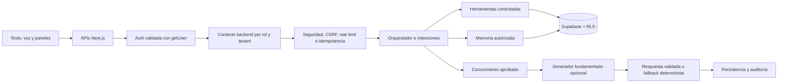

# DomiU — Domi AI Enterprise

Plataforma de domicilios multirol para clientes, negocios, repartidores y administradores. Incluye **Domi**, un agente integrado que conversa por texto y voz, mantiene contexto, usa memoria autorizada y ejecuta herramientas controladas dentro de DomiU.

## Estado

Release Candidate Enterprise. La rama de entrega debe superar GitHub Actions, build de Vercel, reconstrucción limpia de Supabase, auditoría de dependencias y validación de seguridad antes de fusionarse a `master`.

Domi mantiene un motor determinista operativo. La capa generativa con OpenAI es opcional, solo redacta sobre hechos verificados y nunca recibe acceso directo a Supabase, permisos ni herramientas.

## Stack

- Next.js 16.2.9, App Router y `src/proxy.ts`
- React 19.2.4 y TypeScript estricto
- Supabase Auth, PostgreSQL, RLS, Storage y Realtime
- Tailwind CSS 4, Zod 4, Recharts y Framer Motion
- OpenAI Responses API como mejora generativa opcional
- Vercel y Docker standalone
- Vitest, Testing Library, ESLint y GitHub Actions

## Arquitectura de Domi



Principios:

- El navegador nunca define el rol, los permisos ni el tenant.
- El modelo no genera SQL ni ejecuta herramientas.
- Las acciones sensibles requieren una herramienta permitida y confirmación.
- Los pedidos definitivos y los pagos permanecen manuales.
- Las preferencias privadas no se convierten en conocimiento global.
- Los datos de otros usuarios, negocios o repartidores permanecen aislados.

## Módulos

- Conversaciones persistentes, resúmenes, contexto y objetivos activos.
- Intenciones, restricciones, presupuestos en COP y recomendaciones verificadas.
- Herramientas separadas para cliente, negocio, repartidor y administrador.
- Carrito reversible y `domi_order_drafts` sin crear pagos ni pedidos definitivos.
- Memoria explícita: consultar, corregir, eliminar, desactivar y borrar.
- Voz con Web Speech API; no se almacenan grabaciones.
- Proactividad consentida con frecuencia y horario silencioso.
- Evaluaciones, aprendizaje privado y publicación supervisada desde `/admin/domi`.
- Auditoría, RLS, rate limiting, idempotencia y defensa contra prompt injection.

## Requisitos

- Node.js 20.19 o superior compatible con Next.js 16.
- npm 10 o superior.
- Proyecto Supabase configurado.
- Clave de Google Maps restringida por dominio y API.
- Cuenta Vercel o Docker para producción.
- Clave OpenAI opcional para la mejora generativa.

## Instalación local

```bash
git clone <repositorio>
cd domiu-app-Ultima-version
cp .env.example .env.local
npm ci
npm run check:env
npm run dev
```

La aplicación local queda disponible en `http://localhost:3000`.

## Variables principales

| Variable | Alcance | Requerida |
|---|---|---|
| `NEXT_PUBLIC_SUPABASE_URL` | Cliente/servidor | Sí |
| `NEXT_PUBLIC_SUPABASE_ANON_KEY` | Cliente/servidor | Sí |
| `SUPABASE_SECRET_KEY` | Solo servidor | Sí |
| `NEXT_PUBLIC_APP_URL` | Cliente/servidor | Sí |
| `NEXT_PUBLIC_GOOGLE_MAPS_API_KEY` | Cliente | Sí para mapas |
| `DOMI_GENERATIVE_PROVIDER` | Solo servidor | No |
| `DOMI_OPENAI_MODEL` | Solo servidor | No |
| `OPENAI_API_KEY` | Solo servidor | No |
| `DOMI_SAFETY_SALT` | Solo servidor | Recomendado con OpenAI |

`SUPABASE_SERVICE_ROLE_KEY` se admite únicamente durante una rotación temporal. La configuración final debe usar `SUPABASE_SECRET_KEY` y eliminar la clave legado comprometida.

## Comandos de ingeniería

```bash
npm ci
npm run lint
npm run test
npm run build
npm run check:env
npm audit --omit=dev
```

Pruebas críticas de Domi:

```bash
npx vitest run src/lib/domi/model/grounded-generator.test.ts
npx vitest run src/test/domi-request-security.test.ts
npx vitest run src/test/domi-web-security.test.ts
```

## Docker

```bash
docker build -t domiu-enterprise:local .
docker run --rm -p 3000:3000 --env-file .env.local domiu-enterprise:local
```

La imagen usa el build standalone de Next.js, ejecuta como usuario no privilegiado y verifica `/api/health`.

## APIs de Domi

| Método | Ruta | Propósito |
|---|---|---|
| `POST` | `/api/domi/chat` | Conversación y herramientas seguras |
| `GET/POST` | `/api/domi/conversations` | Listar o crear conversaciones |
| `GET/PATCH/DELETE` | `/api/domi/conversations/:id` | Leer, editar o eliminar una conversación propia |
| `GET/PUT` | `/api/domi/settings` | Preferencias de memoria, voz y proactividad |
| `GET/PATCH` | `/api/domi/proactive` | Avisos verificados y estado de lectura |
| `POST` | `/api/domi/feedback` | Evaluación supervisada |
| `POST` | `/api/domi/voice` | Ciclo de sesión de voz sin audio almacenado |
| `GET/POST` | `/api/admin/domi` | Métricas y revisión administrativa |
| `GET` | `/api/health` | Estado mínimo de aplicación y base de datos |

Las mutaciones aceptan JSON del mismo origen, requieren autenticación y aplican autorización por propietario, rol o tenant.

## Seguridad

- Sesiones validadas mediante `supabase.auth.getUser()`.
- Cookies seguras, HTTP-only y SameSite.
- Encabezados internos eliminados antes del proxy y regenerados tras autenticar.
- CSP, HSTS, Permissions Policy, frame denial y no-sniff.
- RLS en todas las tablas de Domi.
- Escaneo de secretos versionados en CI.
- Auditoría de dependencias de producción y desarrollo.
- Salidas generativas sanitizadas y rechazadas cuando inventan valores verificables.
- Fallback determinista ante error, timeout, ausencia de clave o respuesta insegura.

## Despliegue

1. Aplicar las migraciones Supabase en orden.
2. Configurar variables en Vercel para Preview y Production.
3. Crear una nueva `SUPABASE_SECRET_KEY` y retirar la clave legado expuesta.
4. Restringir Google Maps por dominio y API.
5. Ejecutar GitHub Actions y revisar que todas las puertas estén verdes.
6. Validar el Preview, `/api/health` y logs de runtime.
7. Fusionar mediante squash.
8. Verificar el despliegue de producción y conservar el deployment anterior como rollback.

## Documentación

- [Arquitectura y comportamiento de Domi](docs/DOMI-COMPLETE-AGENT-2026-07-19.md)
- [Runbook de producción](docs/DOMI-AI-ENTERPRISE-RUNBOOK.md)
- [ADR: modelo fundamentado](docs/adr/0001-domi-grounded-generative-layer.md)
- [ADR: herramientas y autorización](docs/adr/0002-server-controlled-tools.md)
- [Estado general del proyecto](PROJECT_STATUS.md)
- [Historial de cambios](CHANGELOG.md)

## Troubleshooting rápido

- **`/api/health` responde 503:** revisar variables obligatorias y conectividad de Supabase.
- **Domi responde de forma determinista:** validar `DOMI_GENERATIVE_PROVIDER=openai` y `OPENAI_API_KEY`; el producto sigue operativo.
- **Una mutación responde 403:** verificar que la solicitud provenga del mismo origen y use cookies válidas.
- **Una mutación responde 415:** enviar `Content-Type: application/json`.
- **El mapa no carga:** revisar restricciones y APIs habilitadas en Google Cloud.
- **Sesión expirada:** eliminar cookies antiguas e iniciar sesión nuevamente.

No se deben fusionar cambios que omitan CI, desactiven RLS, reduzcan validaciones de tenant o introduzcan archivos de entorno al repositorio.
