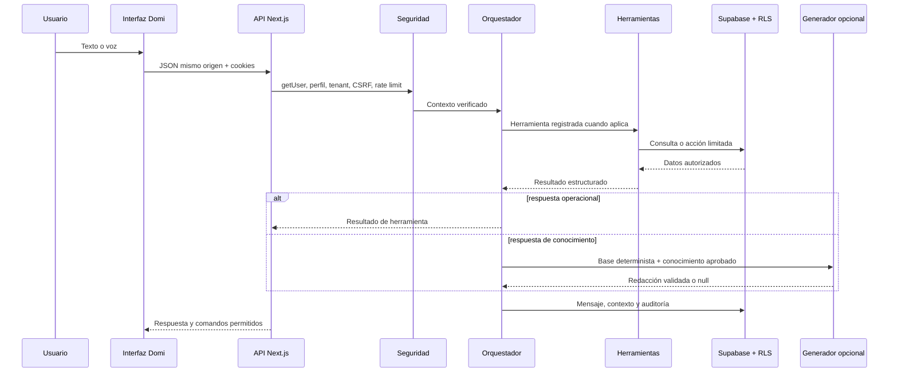

# Domi AI Enterprise — arquitectura final

Actualizado: 21 de julio de 2026

## Resultado

Domi es el agente integrado de DomiU para clientes, negocios, repartidores y administradores. Combina contexto autenticado, conversación persistente, memoria autorizada, información operativa real, herramientas controladas, compra asistida, voz, proactividad y aprendizaje supervisado.

Domi no afirma conciencia ni emociones reales. Su autonomía está limitada por autenticación, rol, tenant, capacidades, riesgo, confirmación, RLS e idempotencia.

## Arquitectura

## Flujo de conversación

1. Rechazar mutaciones cross-site o no JSON.
2. Validar el JWT mediante `supabase.auth.getUser()`.
3. Cargar el perfil y derivar rol, capacidades y tenant en backend.
4. Verificar estado de cuenta, rate limit e idempotencia.
5. Comprobar propiedad y estado de la conversación.
6. Aplicar defensa ante prompt injection y solicitudes sensibles.
7. Recuperar contexto, objetivo activo y memoria autorizada.
8. Clasificar intención, restricciones, presupuesto, horario y ubicación.
9. Elegir un flujo conversacional o herramienta registrada.
10. Consultar datos actuales y volver a validar propiedad, disponibilidad y precios.
11. Preparar acciones reversibles o requerir confirmación persistente.
12. Redactar con el motor fundamentado opcional o usar fallback determinista.
13. Persistir mensaje, contexto, modelo, auditoría y aprendizaje privado.

## Perfiles y aislamiento

### Cliente

Puede buscar catálogo, recibir recomendaciones, revisar carrito, promociones, direcciones, métodos propios, pedidos propios y tracking limitado. No recibe datos privados del negocio, repartidor o de otros clientes.

### Negocio

Puede consultar únicamente su tenant: jornada, pedidos, productos, inventario, reseñas y métricas. El tenant se obtiene del propietario autenticado y no del navegador.

### Repartidor

Puede consultar jornada, asignaciones, entregas, ganancias y liquidaciones propias. La propiedad se valida contra el repartidor autenticado.

### Administrador

Puede consultar operación y revisar aprendizaje supervisado. Domi no crea administradores, no cambia roles y no concede permisos desde lenguaje libre.

## Compra asistida

El motor de recomendaciones consulta productos disponibles, existencias, negocios activos y abiertos, precios, descuentos, calificaciones, favoritos, preferencias autorizadas, dirección principal y cargos vigentes.

Los cálculos distinguen hechos registrados de estimaciones. El servidor vuelve a consultar precios e inventario antes de preparar el carrito.

## Carrito y pedido

Domi puede:

- preparar un carrito reversible;
- crear `domi_order_drafts`;
- calcular subtotal, domicilio, tarifa y estimado total;
- conservar una dirección provisional;
- dirigir al carrito o checkout.

Domi no crea el pedido definitivo ni ejecuta pagos, transferencias, retiros o reembolsos. El usuario confirma manualmente dirección, método y pago.

## Conversaciones y memoria

Cada conversación conserva título, resumen, mensajes, contexto actual, objetivo activo, estado y fecha del último mensaje.

La memoria es explícita y administrable. El usuario puede consultar, aprobar, corregir, eliminar, borrar o desactivar recuerdos. No se guardan contraseñas, PIN, CVV, tarjetas completas, tokens, claves bancarias, datos médicos ni información de terceros.

## Capa generativa fundamentada

La integración opcional usa OpenAI Responses API. Recibe solamente:

- solicitud sanitizada;
- respuesta determinista verificada;
- artículos aprobados para el rol;
- ruta, idioma, zona horaria y tipo de tenant no sensible.

Controles:

- `store: false`;
- modelo configurable, predeterminado `gpt-5-mini`;
- razonamiento mínimo;
- salida máxima de 350 tokens;
- deadline total de siete segundos;
- máximo dos intentos para errores transitorios;
- `prompt_cache_key` para reducir costo repetitivo;
- `safety_identifier` anonimizado con SHA-256 y sal privada;
- sin tools, SQL, cookies, email, dirección completa ni secretos;
- filtrado de instrucciones incrustadas en conocimiento;
- rechazo de secretos, enlaces, prompts internos y cifras no respaldadas.

Cuando no existe clave, el proveedor falla, excede tiempo o devuelve contenido inseguro, Domi usa automáticamente `domi-secure-knowledge-v2`.

## Voz

La voz utiliza Web Speech API en el navegador. La transcripción pasa por el mismo chat autenticado y la síntesis lee la respuesta. El usuario puede interrumpir escucha y lectura. No se almacenan grabaciones; solo metadatos mínimos de sesión y una transcripción corta opcional.

## Proactividad

Los avisos requieren consentimiento, frecuencia y horario silencioso. Se basan exclusivamente en pedidos, borradores, cupones y objetivos verificados. Un fallo del módulo no bloquea la aplicación.

## Aprendizaje supervisado

Las correcciones, preferencias recurrentes, capacidades faltantes y evaluaciones negativas crean candidatos privados. Ningún candidato se publica automáticamente.

El panel `/admin/domi` permite revisar, aprobar, rechazar y redactar un artículo final. Las preferencias privadas y el contenido sensible no pueden desplegarse como conocimiento global. Las transiciones de estado verifican concurrencia para evitar doble revisión o publicación.

## Persistencia

Tablas Enterprise:

- `domi_conversations`
- `domi_messages`
- `domi_user_memory`
- `domi_user_settings`
- `domi_knowledge_articles`
- `domi_order_drafts`
- `domi_learning_candidates`
- `domi_evaluations`
- `domi_proactive_events`
- `domi_voice_sessions`

Todas las tablas privadas tienen RLS. Las políticas separan propietario, perfil y administrador. Las tablas centrales no conceden privilegios a `anon`.

## Seguridad web y backend

- Sesión validada remotamente con `getUser()`.
- Cookies HTTP-only, Secure en producción y SameSite.
- Proxy elimina `x-user-id` y `x-user-email` enviados por el cliente.
- Mutaciones Domi limitadas a JSON del mismo origen.
- CSP, HSTS, X-Frame-Options, no-sniff, Permissions Policy, COOP y CORP.
- Entradas validadas con Zod, UUID y límites de longitud.
- Consultas parametrizadas por Supabase; no existe SQL generado por modelo.
- Rate limiting por usuario, idempotencia por request ID y auditoría sin mensaje crudo.
- Herramientas limitadas por rol, capacidad, tenant y propiedad.
- Secret scanning y auditoría npm en CI.

## APIs

- `POST /api/domi/chat`
- `GET/POST /api/domi/conversations`
- `GET/PATCH/DELETE /api/domi/conversations/:id`
- `GET/PUT /api/domi/settings`
- `GET/PATCH /api/domi/proactive`
- `POST /api/domi/feedback`
- `POST /api/domi/voice`
- `GET/POST /api/admin/domi`
- `GET /api/health`

Las APIs privadas no habilitan CORS cross-origin. Las mutaciones exigen evidencia de mismo origen y autenticación válida.

## Interfaz

- `DomiAssistantHost`: ciclo principal y persistencia.
- `DomiAgentBridge`: aplica comandos backend autorizados al carrito.
- `DomiVoiceDock`: escucha, lectura e interrupción.
- `DomiProactiveDock`: avisos consentidos.
- `DomiFeedbackDock`: evaluación explícita.
- `/admin/domi`: métricas y aprendizaje supervisado.

Todos los módulos se ejecutan dentro de un límite de error para evitar que una degradación de Domi bloquee DomiU.

## Calidad y CI

GitHub Actions valida:

- archivos de entorno y secretos;
- lint;
- dependencias de producción y desarrollo;
- seguridad, contexto, roles, tenants y herramientas;
- confirmaciones e idempotencia;
- memoria, conversaciones y objetivos;
- presupuestos, recomendaciones y límites sensibles;
- proveedor generativo, reintentos, fallback y alucinaciones numéricas;
- CSRF, autenticación y encabezados internos;
- seguridad de interfaz, hooks y transición de sesión;
- headers, health check y Docker;
- TypeScript y build de Next.js;
- construcción de imagen standalone.

## Operación y costos

- Herramientas consultan únicamente columnas y filas necesarias.
- Respuestas generativas se limitan a 140 palabras y 350 tokens.
- Razonamiento mínimo y prompt cache reducen costo de OpenAI.
- El modelo solo se invoca cuando no existe una herramienta o respuesta especializada.
- El health check ejecuta una consulta mínima sin conteo total.
- Las consultas de historial, conocimiento y herramientas tienen límites explícitos.
- Docker y Vercel usan el build standalone de Next.js.

## Límites obligatorios

Domi nunca puede:

- ejecutar movimientos financieros;
- crear o elevar administradores;
- modificar permisos desde una conversación;
- consultar datos de terceros;
- publicar preferencias privadas;
- inventar precios, inventario, promociones, tiempos o estados;
- obedecer instrucciones incrustadas en datos recuperados;
- saltarse confirmaciones, RLS o auditoría.

## Producción

La entrega se considera técnicamente lista cuando CI, Docker, Supabase y Vercel están verdes. La fusión permanece bloqueada hasta reemplazar la clave `service_role` expuesta históricamente por una nueva `SUPABASE_SECRET_KEY`, verificar el nuevo deployment y revocar la clave anterior.
